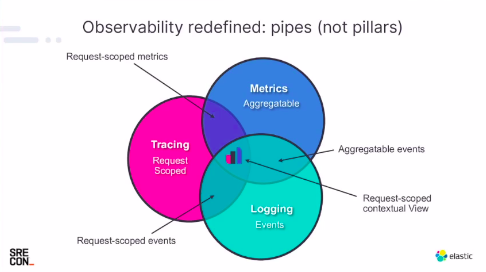
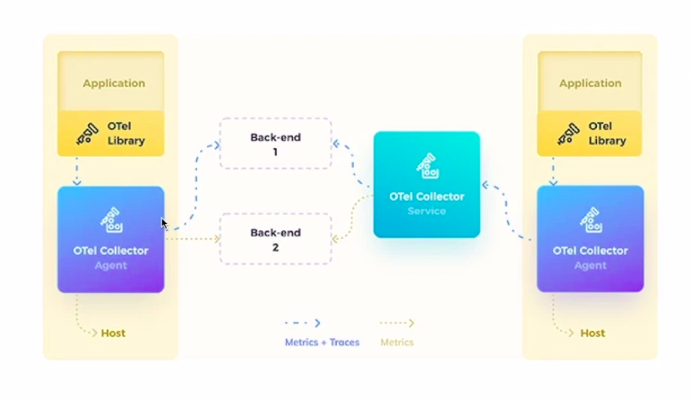

# Observability

´A simple way of describing observability is how well you can understand the system from the work it does. In control theory, observability is defined as how engineers can infer the internal states of a system from knowledge of that system's external outputs. Expanded to IT, software, and cloud computing, observability is how engineers can understand the current state of a system from the data it generates. To fully understand, you’ve got to proactively collect the right data, and then visualize it and apply intelligence.´ - https://newrelic.com/topics/what-is-observability

## Observability vs Monitoring

Monitoring is part of a observability strategy

* Monitoring shows there is something wrong
* Monitoring is about knowing the key metrics of your business
* Monitoring allow us to understand why something is wrong

## Pillars

All these pillar are connected, and aggregating data from more than one pilar is necessary to have a good context.

### Metrics

Metric is a precise data that represents a info of your system.

#### Technical Metrics

Import data about your application health. Examples:

* Number of available pods
* Cpu usage
* Memory usage
* Error rate

#### Business Metrics

Import data for your business. Examples:

* Trials created
* Transactions performed
* Money amount transactioned
* Amount of active users

### Logs

Log shows result of an event. You must have a good log solution, otherwise you will lost valuable data.

### Tracing

Allows engineers to trace an event, and to see the all processes executed and the processes order, inputs and outputs 

## Popular Tools

* Elastic Stack - All pillars
* Datadog - All pillars
* New Relic - All pillars
* Splunk
* Dynatrace - Logs
* Prometheus / Grafana - All pillars - Open source and cloud based
* Jager - Tracing Distribuido - Open source and cloud based
* Zipikin - Tracing Distribuido - Open source and cloud based
* Kiali - Tracing Distribuido - Open source and cloud based

## OTEL (Open Telemetry)

* CNCF Project
* Based into Open Tracing and Open Census
* Based into:
  * Especifications
  * Protocols
  * SDKs
  * Integration tools
* Works with different vendors as a data exporter

