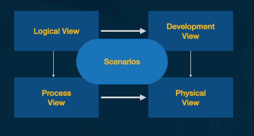

# Arquitetura de soluções

Process to determine structure, components, modules, interfaces of a software solution in order to satisfie functional and non functional requisits, as well as software behavior.

Suggests/defines technologie stack, plataforms, tools, infra.

Provides a blueprint of the software solution and how to develop it, integrations involved.

Normally utilized in Enterprise Softwares

## Solutions Architect Profile

* Business understanding
* Different technologies
* Able to account for context, business restrictions, operational aspects, costs and technologies to develop a solution.
* Prepared to deliver complex solutions to enterprise environments

## Soft Skills

* Adaptability to contexts and projects
* Comunication
* Leadership
* Strategy
* Criativity
* Emotional intelligence
* Team work
* Listening

## Solution Architecture Principles

* Business objectives alignment
* Flexibility
* Reusability
* Interoperability
* Maintenability
* Compliance
* Portability

## TCO (Total Coast of Ownership)

A good software architecture is made of use cases, tech solution, infraestructure services. It also can be used to calculate the total coast of ownership (TCO) of the software, showing the financial impact of the solution.

### Definition

Financial metric that represents the total coast to buy, develop and operate a solution through time.

### Calculation Format

* Aquisition
* Implementation
* Manutenibility
* Operation
* Inativation

## Solutions Architecture Layers

* Business (Layer 0)
* Tech (Layer 1)
* Deployment (Layer 2)

### Business - Vision

* Reason to exist
* Principal objectives to guide solution
* High level vision of the solution, requirements and people envolved

### Business - Escope

* Solutions limits
* Problem to be solved, functional and non functional requirements
* Components systems and technologies
* Restrictions and information that influences a solution design

## Domain and Context

* Really good business knowledge
* Domain through the eyes of te participants (Salesman, partner, different departments...)
* How all these is conected and which "language" is used

### Language

Each department has an own language that they speak. This has to be mapped for a better comunication and it should be taken into account while designing and developing the software.

## Conway Law

Conway Law is a principle that says a software design is influenced by the organizacional structure of the group that develops it. This means that the communication structure of the group will be reflected into the system.

## View and View Points

### View

A vision is a representation of many structural aspects of an archticture. It shows how the architecture approaches one or more points, and what stakeholders are involved.

### Viewpoint

Is a collection of patterns, models and conventions to build a view. It defines the people who is interested, and their concerns. This concerns are reflected into the view point, principles and templates.

### 4 + 1

## Risks and Documentation

High risk solutions should have a high documentation level. Low risk, low documentation.