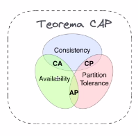

# System Design

System design is the process to design a system architecture, components, modules, interfaces and data to attend system requisites

## Importance

* Think into system architecture in a functional way
* Think about decisions that really matters
* Explore possible solutions
* Vision of present and future
* Exercising your mind to plan different solutions

## System Design vs Big Techs

* Normally, it is part of the hiring process of all big techs
* How candidate solves problems
* Skill set and tecnologies knowledge
* Deduction capacity
* Communication capacity

## System Design in Real World

* It is a tool
* It is a way to express yourself
* It brings convictions
* It helps to sell products

## Specification and Documentation

* System requisites
* Capacity estimation
* Data modeling
* API Design
* System Design
* Explore and Explain

## System Requisites

* Core Features and domain
  * Understanding application domain and main functionalities
* Support features
  * Functionalities that helps to attend main functionalities 

### Practice

Tool: Excalidraw

#### CAP Teorem

## Capacity Plan

* Requests per second (estimate or real)
* Events per second (ex: purchases per second)
* Bandwith (requests per second vs bytes transfered)

### Storage

storage = writes * request size * replication factor

#### Cost

rps * data size * replication factor = 0.75 MB/s

* daily -> 0.75 * 10^5 = 75 GB
* yearly -> 0.75 * 10^5 * 365 = 27.3 TB

#### Example

- 1Mi DAU (Daily Active Users)
- Cada usuário faz 1 requests
- Cada request results in 20KB
- Reads vs Writes: 9:1
- Replication factor 3

##### Bandwidth

- (10^6 requests/day X 2*10^4 B transfer data)/10^5
- 2*10^10 / 10^5
- 2*10^5 = 0,2 MB/s

##### Storage

###### Daily

- 2*10^10 requests/dia * 1*10^-1 percents of write * 3 replication factor
- 6*10^9 = 6GB

###### Yearly

- 6 * 10^9 storage daily * 365 days = 2190 * 10^9 = 2,19 TB