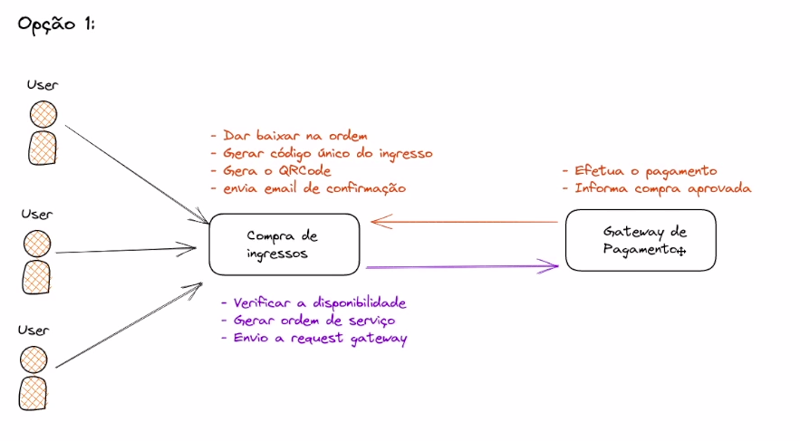
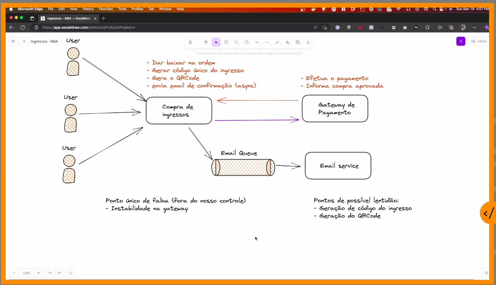
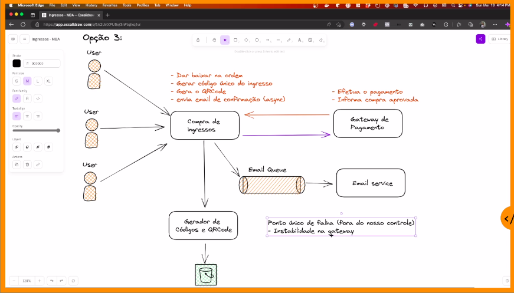
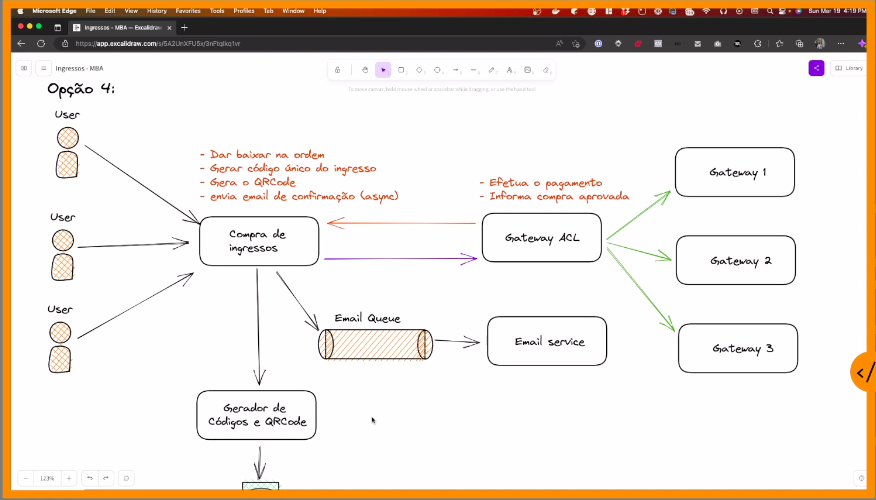
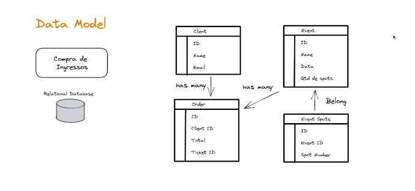
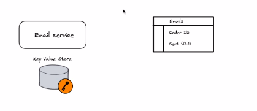
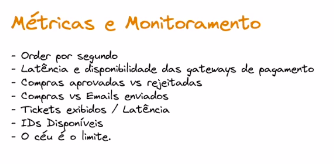

# System Design In Practice

## Ticket Purchase

### Premisses

* Only credit card purchases
* Purchase needs to be confirmed instantly
* Must have consistency over high availability
* Concurrency - dont sell same ticket to more than one person
* Ticket code must be short

#### First Option

##### Tradeoffs

#### Second Option

#### Third Option

#### Fourth Option

#### Data Modeling

#### API Design

##### Purchase
placeOrder(userId, eventId, spotId) (OrderId, TicketId)

##### View ticket

viewTicket(ticketId) (OrderId, UserId, UserName, EventDate, Spot, Total)

#### Metrics and monitoring
