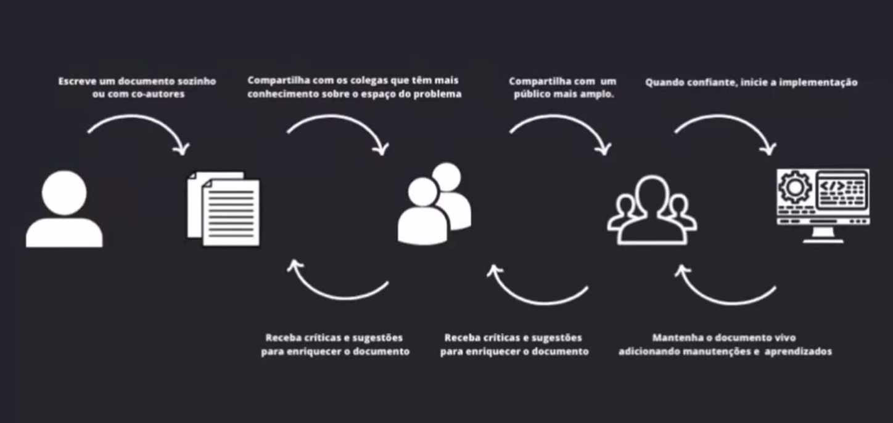

# Design Docs

## Concept and motivation

Relativily non-formal documents where the principal author of software system design before coding. The document contains the implementation satrategy in a high level and the main decisions with highligth to trade offs evaluated. This documents are written by the team to help the understandig of the decisions made during design.

## Goals

* Find problems earlier
* Get to a consense
* Transversal concerns - security, monitoring, impact in other areas
* Scale knowledge
* Organizational memory
* Portfolio to a promotion

## Document Structure

### Headers

* Authors 
* revisers
* document state 
* creation date
* Tags

### General Vision

High level explanation to help people undertand the problem.

### Scope and Context

* System picture
* motivations
* informations to understand the problem

### Objectives and Out of Scope

Objectives are system requirments, functional or non functional requirments. Out of scope are things you won't do at the moment.

### Design

Design the solution that will attend your requirments. It may contain diagrams with context and appliccations, APIs, data required and info about data sensitivity, sequence diagrams and etc. It is unusual to contain code, payloads and graphic design.

#### Tradeoffs

This is what adds more value to the document. It should be done carefully.

#### Others

* Testability and observability
* Implantantion
* Questions not answered

## Document Lifecicle

## When to not write this document

* When there is no complexity
* When the solution is imposed
* When the team does not use the document and sees it as a waste of time

## Other documents

* ADR
* RFC
* Tutorial
