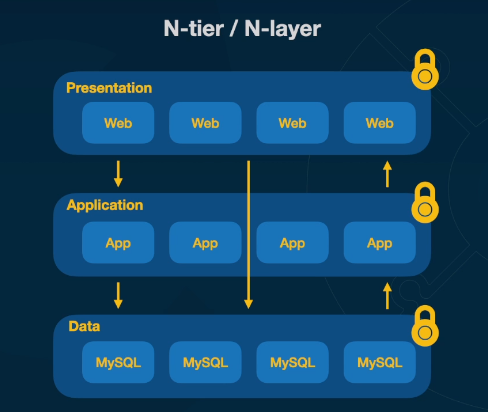
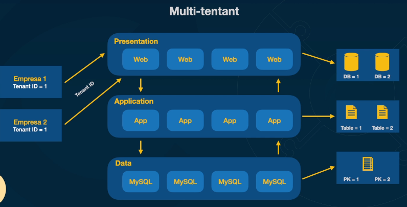
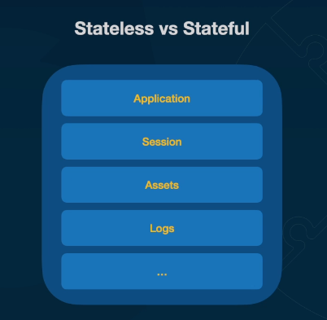
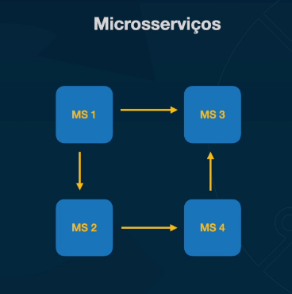
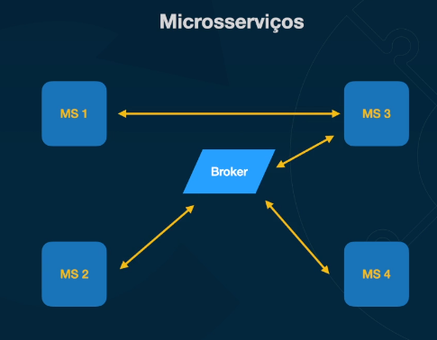
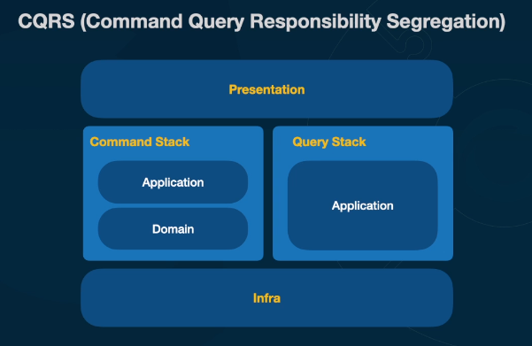

# Design Patterns

## N-tier / N-layer

## Multi-tenant

## Stateless vs Stateful

## Serverless

* S3
* API Gateway
* Lambda Function
* Cloud Trail
* DynamoDB

## Microservices

Should avoid high coupled services: messaging vs rest

### Motivation

* Principal: Organizational / Teams
* Escalability
* Responsability seggregation
* Different Technologies
* Low coupling

### Microservices vs Complexity

* Organizational maturity
* Teams maturity
* Deployment
* Observability
* Troubleshouting

## CQRS

## Cache

* Time based invalidation
* Least Recently Used (LRU)
* Most Recently Used (MRU)
* Least Frequently Used (LFU)
* TTL based invalidation
* Write through invalidation - cache updated when writing
* Write back invalidation - Write in cache first

## Distributed Locking

* Data Consistency
* Resources saving
* Avoid dead locks
* Resources efficiency

## Configuration

* Configuration can change at any moment
* How to change db password, mail creds, etc... Without having to deploy the application

## Secret Management

* Creds cannot be going from hand to hand in the company
* Processes to rotate creds are important
* Managed services can make it easy
    * Hashicorp Vault
    * AWS Secret Manager
      * Store secrets
      * Rotate secrets automatically to all AWS services
      * SDK to recover secrets during execution time

## Circuit Breaker

Circuit breaker works similar to a eletronical circuit. But, as a software pattern, it is about two microservices sending http requests. The circuit starts closed. This means all requests will be sended. If one microservice starts to return lots of erros, the circuit opens. This means that no requests will be made. The open circuit prevents that tons of requests are made to a microservice that is trying to recover from a problem. To close the circuit again, there is a status called half-closed. In thes moment a few requests will be made to test if the microservice recovered. If everithing is ok, circuit is closed, otherwise, circuit is open again. It is a good practice to implement a circuit breaker on a proxy and not inside microservices

## Sequencing

To solve id collision into different microservices, the sequence pattern implements one microservice just to generate ids. Other services will request an id when need. This prevents different services to work with the same id.

## API Gateway

* Centralizador de requisições
* Roteamento
* Autenticação
* Data conversion
* Headers
* Throttling - Retains a few requests and send with delay
* Rate limit - Requests limit per service

## Event Driven Architecture

* Events happen in the past
  * Event Notification - Partial data
  * Event Carried State Transfer - Full event data
  * Event Sourcing - Full event is stored in a database and sent
    * Allows to recreate a state
  * Events can be a trigger for other systems
  * Coreography vs Orchestration

## Publish - Subscribe

Into an event driven architecture, sometimes an event is needed in more than one service. To prevent redundant code to send events and high coupling between services, pub-sub pattern suggests that the origin service sends a message to a topic and every service that needs the event subscribes to listen to the topic. So orign service do not have to know the services that need the event, it only publishs the event.

## Backend for Frontend (BFF)

Backend especific for a family of devices. It allows to send only needed data to devices that may be working with slow conections. Your frontend will be able to have only the data it needs. It works pretty similar to a proxy.

## Sidecars

* Aux applications
* Logs collectors
* mTLS
* Trafic controll

## Service Mesh

Service mash is a layer of infraestructure that you cand add to your application. It allows to add resources transparantely, such as observability, trafic management and security. All this without having to change your code.

### Istio

* Trafic manangement
* Security
* Policy enforcement
* Observability
* Extensibility