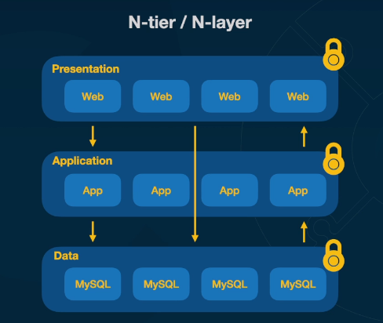
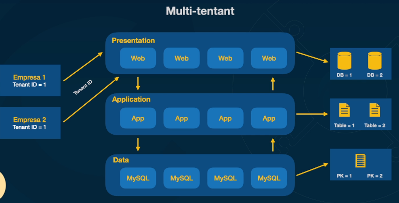
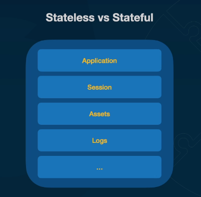
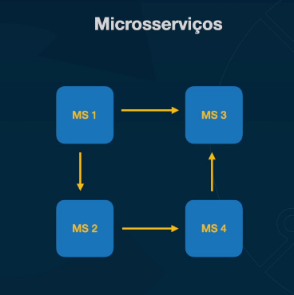
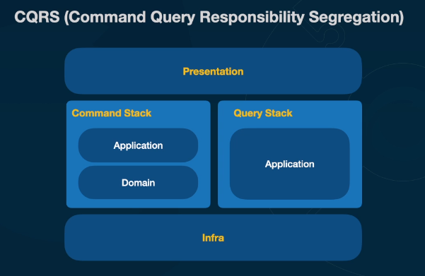

# Design Patterns

## N-tier / N-layer

## Multi-tenant

## Stateless vs Stateful

## Serverless

* S3
* API Gateway
* Lambda Function
* Cloud Trail
* DynamoDB

## Microservices

Should avoid high coupled services: messaging vs rest

### Motivation

* Principal: Organizational / Teams
* Escalability
* Responsability seggregation
* Different Technologies
* Low coupling

### Microservices vs Complexity

* Organizational maturity
* Teams maturity
* Deployment
* Observability
* Troubleshouting

## CQRS

## Cache

* Time based invalidation
* Least Recently Used (LRU)
* Most Recently Used (MRU)
* Least Frequently Used (LFU)
* TTL based invalidation
* Write through invalidation - cache updated when writing
* Write back invalidation - Write in cache first

## Distributed Locking

* Data Consistency
* Resources saving
* Avoid dead locks
* Resources efficiency

## Configuration

* Configuration can change at any moment
* How to change db password, mail creds, etc... Without having to deploy the application

## Secret Management

* Creds cannot be going from hand to hand in the company
* Processes to rotate creds are important
* Managed services can make it easy
    * Hashicorp Vault
    * AWS Secret Manager
      * Store secrets
      * Rotate secrets automatically to all AWS services
      * SDK to recover secrets during execution time

# Circuit Breaker

Circuit breaker works similar to a eletronical circuit. But, as a software pattern, it is about two microservices sending http requests. The circuit starts closed. This means all requests will be sended. If one microservice starts to return lots of erros, the circuit opens. This means that no requests will be made. The open circuit prevents that tons of requests are made to a microservice that is trying to recover from a problem. To close the circuit again, there is a status called half-closed. In thes moment a few requests will be made to test if the microservice recovered. If everithing is ok, circuit is closed, otherwise, circuit is open again. It is a good practice to implement a circuit breaker on a proxy and not inside microservices