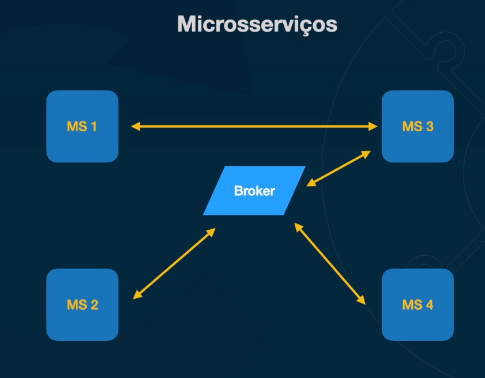

# Design Patterns

## N-tier / N-layer

## Multi-tenant

## Stateless vs Stateful

## Serverless

* S3
* API Gateway
* Lambda Function
* Cloud Trail
* DynamoDB

## Microservices

Should avoid high coupled services: messaging vs rest

### Motivation

* Principal: Organizational / Teams
* Escalability
* Responsability seggregation
* Different Technologies
* Low coupling

### Microservices vs Complexity

* Organizational maturity
* Teams maturity
* Deployment
* Observability
* Troubleshouting

## CQRS

## Cache

* Time based invalidation
* Least Recently Used (LRU)
* Most Recently Used (MRU)
* Least Frequently Used (LFU)
* TTL based invalidation
* Write through invalidation - cache updated when writing
* Write back invalidation - Write in cache first

## Distributed Locking

* Data Consistency
* Resources saving
* Avoid dead locks
* Resources efficiency
